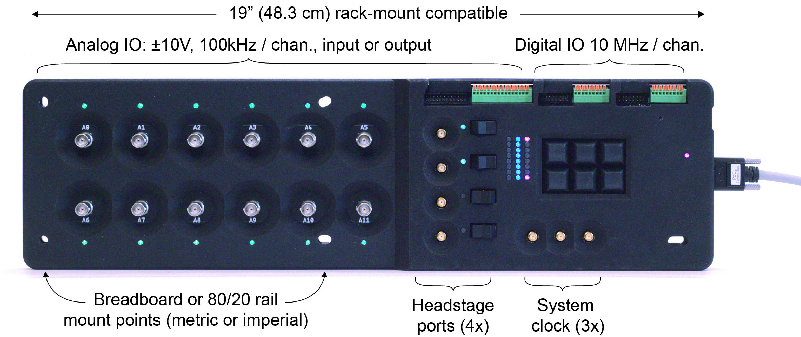

# ONIX Breakout Board
This board allows bench access to the IO provided by the [ONIX FMC Host
Board](https://github.com/open-ephys/onix-fmc-host). It features:

- 4x coax headstage ports, each with a physical power switch
- BNC, IDC (ribbon), or direct wire access to 12 analog inputs or outputs
- IDC (ribbon) or direct wire access to 8 digital outputs and 8 digital inputs
  (5 volt tolerate)
- 6x buttons for marking experimental events
- 41x state-indication LEDs
- 3x high-speed clock feed throughs
- Full-speed, USB 2.0 access to the onboard [TinyFPGA
  BX](https://www.crowdsupply.com/tinyfpga/tinyfpga-bx) for communication,
  programming, and customization 
- [HARP bus](https://www.cf-hw.org/harp)
- Rugged M6 or 1/4-20 mounting options compliant with 19" racks and optical
  tables
- Open-source [gateware](./gateware) created using open-source FPGA toolchain:
  [yosys](http://www.clifford.at/yosys/) & [nextpnr](https://github.com/YosysHQ/nextpnr)

